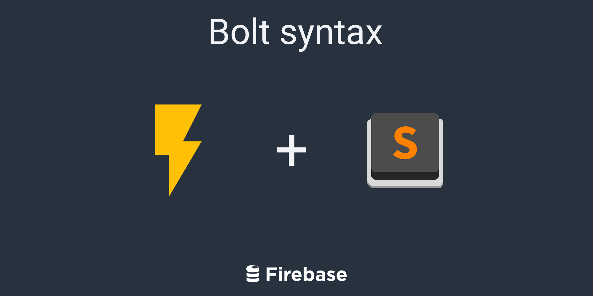
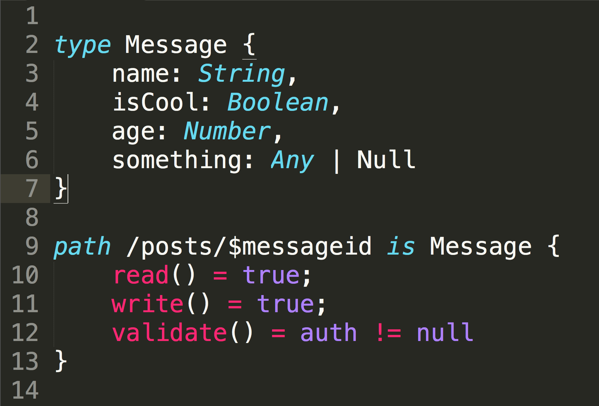

Syntax highlighting for [the Bolt compiler](https://firebase.com/docs/security/bolt/quickstart.html) for Sublime Text 3.

## Syntax in Action

### I am not a Sublime Text 3 expert.

This is not an offically supported Firebase repo. This is community-based. So PRs are totally accepted. This is a rough fork of [Brian Ford's JavaScript Sublime Pacakge](https://github.com/btford/sublime-text-javascript).

## Installation - Sublime Package Control
1. Open the package control menu in Sublime
2. Choose 'Package Control: Add Repository'
3. Add this repository
4. Open the menu again and install the package 'bolt-sublime'
5. Enjoy!

## Installation - OSX
1. Clone the repo
2. run ./install.sh
3. The cloned folder is safe to remove
4. Enjoy!

## Installation - Windows
1. Clone the repo
2. Move the unzipped files into `C:\Program Files\Sublime Text 3\Packages`
3. Enjoy!

Copyright 2015 David East

Licensed under the Apache License, Version 2.0 (the "License");
you may not use this file except in compliance with the License.
You may obtain a copy of the License at

    http://www.apache.org/licenses/LICENSE-2.0

Unless required by applicable law or agreed to in writing, software
distributed under the License is distributed on an "AS IS" BASIS,
WITHOUT WARRANTIES OR CONDITIONS OF ANY KIND, either express or implied.
See the License for the specific language governing permissions and
limitations under the License.
